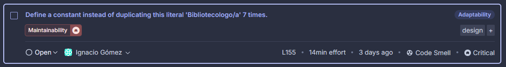

# Inspección con Sonarcloud

Este es el resumen que nos dió la aplicación, se puede ver una advertencia bastante grave a simple vista en la pestaña de seguridad.
## Primer Quality Issue

Como se logra apreciar en la imagen, tenemos un grave error en la parte de seguridad, y es que tenemos la clave secreta de DJANGO expuesta, esto puede tener consecuencias de seguridad muy graves, como por ejemplo poder hacer log in, luego acceder a datos personales de los usuarios, o crear usuarios para entrar como bibliotecólogo y subir PDF's con información distinta como estafas, entre otros.
La aplicación recomienda borrar la clave, cambiarla y sacarla del código, por lo que deberíamos usar un archivo .env para mantener la clave oculta y segura, este archivo se crea y se guarda en la raíz del proyecto, al subir el proyecto, se agrega esa ruta en el gitignore, pero como se tiene que revisar el proyecto, lo mantendremos visible para la revisión del hito. Eso si, cabe destacar que un ambiente real de producción no debería estar.

## Segundo Quality Issue

Luego de inspeccionar los issues, no habían errores muy graves, pero si muchos como este que se muestra en la imagen, en donde hay un problema con la mantenibilidad, esto debido a que reduce la eficiencia y escalabilidad del código, además de que puede llevar a inconsistencias si esa línea se quiere cambiar en muchas partes.
Entonces lo recomendado por la aplicación es crear una constante en lugar de duplicar esa línea en muchos sectores del código, nos parece una buena solución, solo que haremos una función para verificar y así solamente la iremos llamando en distintos sectores del código.